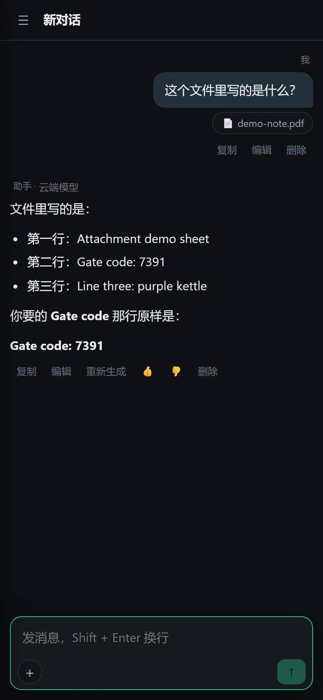
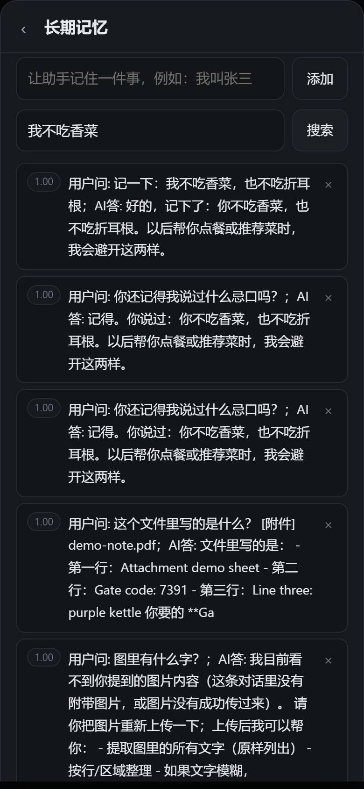
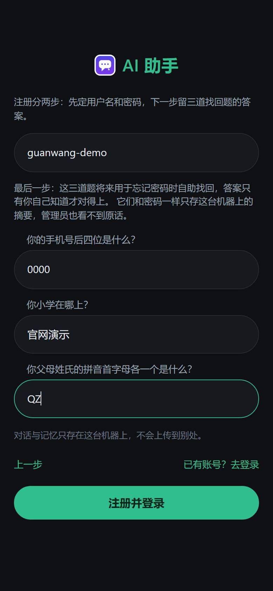
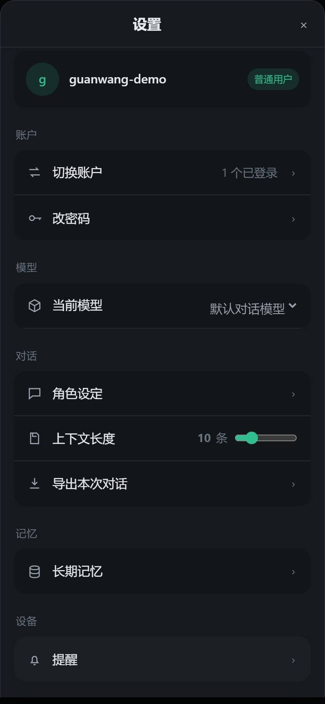

# Fenver

**跑在你自己服务器上的个人 Agent 助理**——自带模型、有记忆、安卓原生、数据不出门。

[](LICENSE)


## 这是什么

一个部署在自家机器上的 AI 助理。不是聊天套壳：它接你自己的模型 key，记得你聊过的东西，
能管你的日程，安卓端是原生写的。全部数据（记忆、会话、配置）都在你自己那台机器的
一个目录里。

适合谁：想把助理跑在家里 NAS 或小云服务器上、不想把数据交给别人 SaaS 的人。
默认注册是关的——装完先由管理员建号，它本来就是给你自己用的。

## 现在能干什么（以及不能干什么）

能做：

- **多模型对话**：DeepSeek、Kimi、智谱、硅基流动、通义这些 OpenAI 兼容接口都实测直连过，
  在管理页里配，默认模型随时换。
- **长期记忆**：基于向量库（ChromaDB），聊过的偏好和事实会按相关度召回，不用每次重新自我介绍。
- **日程**：「今天该干什么」的清单和提醒，网页月历视图，安卓原生同样有。
- **安卓原生客户端**：不是网页套壳。长按说话整屏接管的语音输入、三态输入区、会话导出、
  应用内一键更新，都是真机上十六轮反馈磨出来的。网页版（PWA）同步保留，功能对齐。
- **语音转文字**：安卓端录音直接转写（本地跑，不上传）。
- **多用户与找回**：每人一份记忆与会话；忘了密码走三道自设找回题。

还不能（说实话版）：

- 能被模型调用的工具目前只有计算器和内置帮助。**搜索和代码执行的工具链是下个版本的主线**，
  别急着拿它当全能管家。
- 定时任务重启会丢，持久化在这一版（v0.24）收口。
- 没有 iOS，短期也不打算做。

## 快速开始

**路 one：Windows 裸机**

```bash
git clone https://github.com/abonla599/fenver
cd fenver
python -m venv venv
venv\Scripts\pip install -r backend\requirements.txt
venv\Scripts\python run_backend.py
```

**路 two：docker-compose**

```bash
git clone https://github.com/abonla599/fenver
cd fenver
docker compose up -d
```

起来之后打开 `http://<你的机器>:8000/app/`：管理员首登用环境变量里引导的账号，
在管理页里配模型、建用户。细节（域名、Cloudflare 隧道、HTTPS、更新通道）都写在
[docs/安装部署指南.md](docs/安装部署指南.md)。

## 长什么样

| 对话 | 记忆 |
|---|---|
|  |  |

| 注册 | 设置 |
|---|---|
|  |  |

## 结构一览

```
backend/            FastAPI 后端（对话、记忆、日程、身份、管理端点）
  app/core/         存储与鉴权：一份 JSON + 一把锁 + 原子替换，没有数据库依赖
  app/web/static/   PWA 前端（手机浏览器直接用，与 API 同源）
android-native/     安卓原生客户端（Kotlin / Compose）
docker/             沙箱镜像与部署文件
docs/               用户手册、安装部署指南、releases/ 更新历史
```

测试全在 `backend/tests/`：约 1150 条，含双端契约测试（网页与安卓的文案、算式、
接口必须一致，漂一个字就红）。跑法：`venv\Scripts\python -m pytest backend/tests -q`。

## 路线图

| 版本 | 干什么 |
|---|---|
| v0.24（当前） | 开源整理、任务持久化、管理端 |
| v0.25 | 打通工具调用（搜索、代码执行） |
| → 1.0 | 补齐双端与工具链；到 1.0 才开始对外运营，代码和自部署这条路永远敞开 |

## 参与

有问题直接开 issue，看到就回。提 PR 前请先读
[CONTRIBUTING.md](CONTRIBUTING.md)（提交日志与运行日志的说人话规范在里面）。

## 许可

[Apache-2.0](LICENSE)。第三方依赖的归属声明见 NOTICE。
